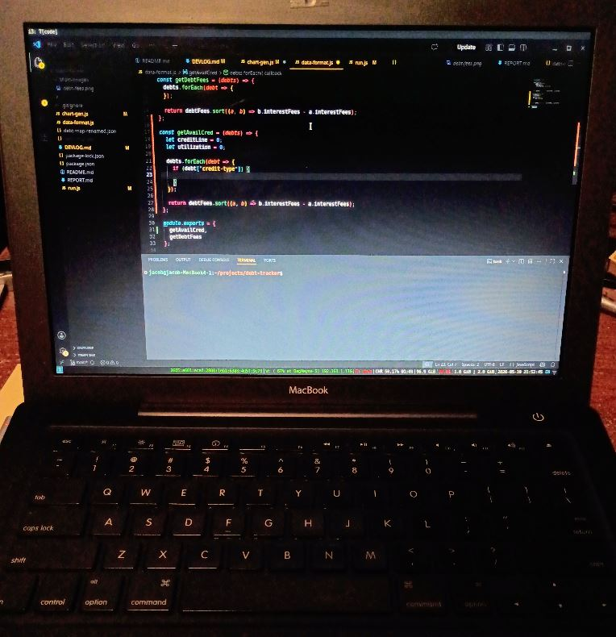

### 05/21/2026

9:55 PM

I need to keep track of the debts over time so I can show the decrease

Lazy way is just a huge JSON file, it saves the current date/overwrite it every run

10:48 PM

I'm always so drained at this time, even drinking coffee doesn't help

I wonder if that's me getting old or what

It makes sense to pay off the highest fee cards first so I can use that extra money to pay down the other ones.

It's that cliche snow ball vs. avalanche method

I just need to be stable for another year or two then I can see the $0.00 net worth

My speeding problem is my only problem lol

---

### 05/20/2026

9:51 PM

Not sure what I'll get done... I was thinking I'd add another bar chart for the debt in descending order by utilization

Feeling spent though, don't even want to watch tv

What sucks is my car will need work but maybe my warranty covers some of it

Using the PixelBook 2017 right now to type this. The shallow keys aren't great compared to the Macbook 2008 keyboard.

But the display and better performance is nice

Still have not gotten suspend to work right on this laptop so it just keeps dying with Ubuntu

9:54 PM

Damn yeah got a headache

Drank some coffee to see if I can work more after work

Watched my hour-long The Boys finale though kind of wasted the night ahh well

---

### 05/19/2026

9:31 PM

Had a reminder today of how bad my financial situation is

CEL came on in my car, apparently related to the turbo

It's a good challenge though, looks like something I can do

But yeah I'm just f'd, need pi chart to show my available credit as back up

Watching TV, I feel so drained/mentally spent this time of the night crazy

Not sure if I should take a brief swig of caffeine after my gym walk

9:47 PM

Alright let me make a quick function make a pi chart of available credit vs. utilized

9:57 PM

See the 2008 Macbook

With the 37.72 CPU load lol

10:02 PM

Hehe my github copilot

10:15 PM

Lol this chart is funny the available credit is like a tiny sliver on the entire pie

10:23 PM

This data is outdated, I put down like $1.5K this paycheck

---

### 05/18/2026

10:49 PM

I'm mentally drained but I want to do something

I want to start doing the image generation from charts

I had a thought that the chart images can just be linked

I'm gonna do a basic debt loss chart, the fees

Bar graph in descending order

I also need to add the credit limit per credit card

11:03 PM

It's so funny this laptop does smell like BO, like if you don't put deodorant on

I'm using this server-side render library that I found/wrapper around Chart.js makes sense

11:13 PM

Alright got a chart to render but it has no bars...

11:14 PM

Oh right they need to be not transparent with rgba

The quality is low maybe the width/height?

11:16 PM

It doesn't look so bad on a better display, it looks bad on this laptop lol

Well that's it for now, I need to actually write out the processes that formats the data

11:19 PM

Oh also this laptop does not like it when I zoom in on an image in VS Code the GUI crashes lol

11:45 PM

Watching tv and writing this, gonna get it plotted

11:52 PM

Alright got the debt interest/fees plotted

Still need to inject it into the report, what was I was thinking about is how to undo, so it's not just a write

Probably another file that's a history?...

---

### 05/15/2026

8:21 PM

This macbook smells weird

Also I noticed the CPU load on it on idle is 40.00 on average ha damn. Yet it's passable.

I probably should use a lighter distro not Ubuntu but at least I'm using i3 and suspend works.

8:37 PM

I'm distracted by the smell of this laptop it's like a perfume or something... it has a new battery in it.

I'm concerned like I'm gonna get cancer using this laptop because there's a blown capacitor or something making the smell ahh well.

Thinking about the report, it should be primarily about the chart, visual, show progress.

I'm a dumbass recenlty I had a $2K credit line increase and what did I do? I spent it all on a radar detector and new tires for my car lmao... ugh. This is why I'm poor. Also being generous/helping people.

---

### 05/13/2026

9:43 PM

Let it be known I'm writing this on my 2008 black Macbook running Ubuntu 24 with a suspend that works!

Typing feels good, keyboard is solid except that it feels slippery the plastic.
